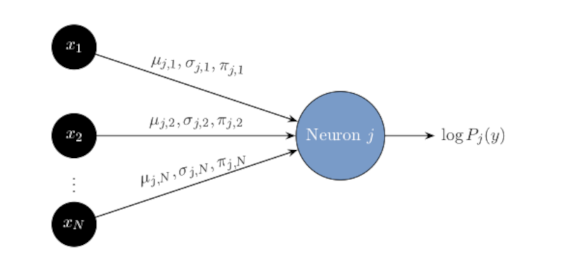

<p align="center">
  
</p>

## uGMM-NN: A Deep Probabilistic Neural Network with Univariate Gaussian Mixture Neurons

This repository introduces the **Univariate Gaussian Mixture Model Neural Network Model (uGMM-NN)**. This experimental feedforward neural network architecture replaces traditional neuron operations with **probabilistic univariate Gaussian mixture nodes**. While primarily designed for generative learning using Negative Log-Likelihood (NLL) loss, the model also performs well in discriminative settings.

---

### Model Formulation

The uGMM-NN reimagines the fundamental building block of a feedforward neural network. Instead of a neuron computing a weighted sum of inputs and applying a fixed non-linear activation, each "neuron" in a uGMM-NN is a **univariate Gaussian Mixture Model (uGMM)**.

### Univariate GMM Nodes

A uGMM neuron j receives N inputs (x₁, ..., xₙ) from the previous layer. 
Its associated Gaussian Mixture Model has exactly N components, 
each corresponding to one input. The means (μⱼ,ₖ), variances (σ²ⱼ,ₖ), and mixing coefficients (πⱼ,ₖ) are learnable parameters unique to neuron j.

### Example Usage

The uGMM-NN follows a classic feedforward neural network architecture, comprising input, hidden, and output layers. Each neuron in the network represents a univariate Gaussian mixture model (uGMM), where the mixture components correspond to inputs from the previous layer. Conceptually, the model forms a hierarchical composition of uGMMs, enabling the construction of complex, high-dimensional probability distributions through successive transformations.

An example illustration of the architecture is shown below.
<p align="center">
  
</p>

The `notebooks` directory contains Jupyter notebooks that demonstrate the usage of this library.

- [Example (generative) inference on the Iris dataset using a uGMM trained with NLL loss.](./notebooks/iris_dataset.ipynb)
- [Example (discriminative) inference on the MNIST dataset](./notebooks/mnist_dataset.ipynb)

### Limitations and Future Work

While promising, the current uGMM-NN architecture has the following limitations:

* **Lack of Efficient MPE Inference:** Efficient Most Probable Explanation (MPE) inference is currently challenging due to the continuous GMM components and complex inter-layer interactions. Developing approximate methods for MPE is crucial for generative tasks like sampling, and efficient inference.

Future research directions include:

* **Architectural Extensions**: Redesigning classical deep learning architectures such as recurrent neural networks (RNNs), convolutional neural networks (CNNs), and transformers using uGMM neurons may enable fully probabilistic versions of these models.
* **Efficient MPE and Marginal Inference:** Developing novel algorithms for MPE and marginal inference.
---
### Related Work
* Peharz, R., Lang, S., Vergari, A., Stelzner, K., Molina, A., Trapp, M., Van den Broeck, G., Kersting, K., and Ghahramani, Z. Einsum networks: Fast and scalable learning of tractable probabilistic circuits. In *Proceedings of the 37th International Conference on Machine Learning (ICML)*. 2020.

* Choi, Y., Vergari, A., and Van den Broeck, G. Probabilistic circuits: A unifying framework for tractable probabilistic models. 2020b.

* Poon, H. and Domingos, P. Sum-product networks: A new deep architecture. In *2011 IEEE International Conference on Computer Vision Workshops (ICCV Workshops)*. IEEE, 2011.

### Citation

If you use this software, please cite it as below:

```bibtex
@software{zakeriaali2025ugmmnn,
  author = {Ali, Zakeria},
  title = {{uGMM-NN: A Deep Probabilistic Model with Univariate Gaussian Mixture Nodes}},
  url = {https://github.com/zakeria/ugmm},
  version = {0.0.1}, 
  year = {2025},
}